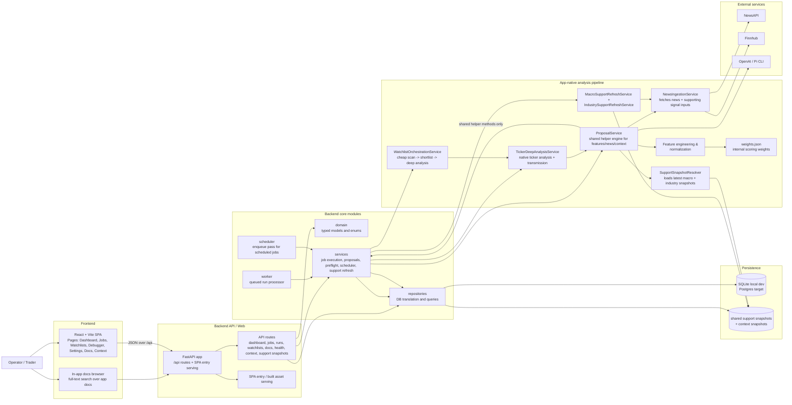

# Architecture

**Status:** canonical current architecture

## Architecture choice

Trade Proposer App uses a modular monolith with explicit internal boundaries. That still makes sense because the product gets more value from local simplicity and shared schemas than from early service extraction.

This only works if it keeps three things true:
- keep business logic on the backend
- keep runtime topology easy to start and debug locally
- make future extraction possible without designing for it prematurely

## Current runtime reality

### Implemented now
- one FastAPI backend process serving the product API
- one React/Vite frontend for operator workflows
- SQLite as the default local persistence engine, with Postgres supported for production-like and deployment environments
- worker and scheduler entrypoints
- repository-based persistence access
- app-native proposal, evaluation, optimization, and macro/industry refresh workflows
- shared support-snapshot storage plus redesign-native macro/industry/ticker context persistence
- snapshot-aware health/preflight reporting

### Target deployment runtime
- API process
- worker process
- scheduler process
- frontend assets served by the API or reverse proxy
- Postgres
- Redis or another queue/coordination layer if concurrency pressure justifies it

## System diagram

## Most important runtime flow today

### Proposal generation
1. user creates or executes a proposal job from the frontend
2. backend enqueues a run in the database
3. worker claims the queued run atomically
4. `JobExecutionService` executes the redesign orchestration path for proposal workflows
5. the active path fetches price history, computes technical/contextual inputs, loads the latest valid macro and industry shared artifacts through the transitional `SupportSnapshotResolver`, and computes ticker-level signals
6. the pipeline emits redesign-native trade outputs and diagnostic payloads
7. backend persists the relevant redesign objects, diagnostics, run summary, and timing data
8. frontend reads run, recommendation-plan, and ticker-signal state back via `/api`
9. if execution fails, run timing and error state are still persisted, but partial downstream writes are not yet rolled back across the full workflow

### Shared macro/industry refresh
1. scheduler or operator triggers macro or industry refresh
2. backend enqueues a refresh run
3. worker claims the queued run and executes it asynchronously; the operator UI now uses only the queued refresh path
4. industry refresh scope is seeded from the taxonomy layer, which now contains split ontology files for tickers, industries, sectors, relationships, and event vocabulary
5. the taxonomy service still supports a fallback monolith file so the repo does not hard-break if the split files are temporarily missing
6. industry context generation now reads ontology relationships and stores matched transmission edges plus ontology provenance inside the snapshot metadata
7. ticker deep analysis now also derives ticker-level relationship edges from the taxonomy layer so transmission diagnostics can show peer, supplier, and customer read-through alongside macro and industry context
8. watchlist orchestration now carries matched ticker relationships forward into stored `RecommendationPlan.signal_breakdown.transmission_summary`, which lets operator review pages surface them without re-reading the full deep-analysis JSON blob
9. watchlist plan-construction logic now also uses matched ticker relationships when writing rationale, action-reason detail, invalidation text, and risk framing, but only as secondary read-through grounded in the active transmission payload
10. frontend review surfaces now share a dedicated ticker-relationship read-through component so ticker and run-detail pages can show the matched edges themselves instead of only a one-line summary
11. taxonomy now also loads governed `themes`, `macro_channels`, `transmission_channels`, `relationship_types`, and `relationship_target_kinds` registries, then normalizes ticker / industry / sector values and explicit ontology relationships against them so downstream consumers are not relying only on scattered free-form strings
12. taxonomy also derives governed `belongs_to_sector`, `linked_macro_channel`, and `exposed_to_theme` edges from industry and sector definitions, which gives downstream services structured ontology links even when those links were not manually duplicated in the stored relationship file
13. relationship payloads now also carry governed `type_label`, `target_label`, `target_kind_label`, and `channel_label` fields in addition to canonical keys, which helps operator-facing provenance stay readable without losing controlled values underneath
14. ticker deep-analysis transmission summaries now emit governed channel-detail arrays for industry and ticker exposure channels, and the service no longer mixes raw theme or macro-sensitivity tags into those channel lists
15. redesign transmission summary semantics such as `transmission_tags`, `primary_drivers`, and `conflict_flags` are now also governed through dedicated registries, with detail arrays carried alongside canonical keys for operator-facing readability
16. event keys still persist separately via fields like `macro_event_keys` and `industry_event_keys`, but they are no longer overloaded into governed summary-tag or primary-driver fields
17. watchlist orchestration now also carries governed transmission detail arrays and exposure-channel detail arrays into ticker-signal diagnostics/source breakdown and recommendation-plan transmission summaries, with fallback label generation when only canonical keys are present
18. operator-facing run-detail, recommendation-plan, and ticker-signal pages now prefer those detail arrays so they render stable readable labels for drivers, tags, conflicts, and exposure channels instead of mostly raw canonical keys
19. macro and industry context snapshots now also persist labeled `transmission_channel_details` on stored event rows, and industry ontology metadata carries the same pattern for profile-level transmission channels
20. context snapshot detail views now prefer those labeled transmission-channel details when rendering event rows and industry ontology sections
21. analytics-facing `context_regime` semantics are now governed through a dedicated registry too, and derivation has been centralized in taxonomy-backed helpers so outcome persistence, calibration slices, and setup-family reviews do not drift apart
22. analytics-facing `transmission_bias` semantics are now governed through the same taxonomy layer instead of relying on raw `context_bias` strings to survive unchanged downstream
23. recommendation calibration and setup-family review buckets now reuse governed analytics labels for both transmission bias and context regime instead of only humanizing raw derived keys
24. recommendation-plan outcomes now also carry readable `transmission_bias_label` and `context_regime_label` alongside canonical analytics keys when repositories hydrate stored evaluation results
25. calibration/review buckets now also carry `slice_name` and `slice_label`, so API-facing analytics objects preserve both canonical grouping semantics and readable labels consistently
26. shortlist decisions and diagnostics now also carry governed `reason_details` / `shortlist_reason_details` plus `selection_lane_label`, so watchlist review pages do not have to render raw shortlist reason codes and lane keys directly
27. calibration reviews now also carry governed `review_status_label` and `reason_details`, while run summaries can expose counted shortlist-rejection detail rows for readable execution triage
28. evidence-concentration cohorts now expose a readable `slice_label` alongside the canonical `slice_name`, so API consumers and operator pages can render cohort families without hand-humanizing backend keys
25. the support-snapshot resolver now backfills baseline industry ontology metadata even when an industry context snapshot is missing, so downstream proposal/ticker analysis code can still see sector and relationship context instead of dropping to a taxonomy-blind fallback
26. refresh services still persist transitional `SupportSnapshot` records first and then materialize redesign-native macro or industry context snapshots from the same run
27. health/preflight currently reports freshness for the shared support snapshots that still gate the transitional refresh layer
28. this means the redesign review UX is ahead of backend convergence: context snapshots are the primary review object, but support snapshots still remain in refresh, health, and resolver paths

## Runtime components

### 1. API process
Responsibilities:
- expose JSON endpoints for dashboard, runs, jobs, watchlists, recommendation plans/outcomes, settings, docs, health, context snapshots, and support snapshots
- validate user input
- create jobs and runs
- read and write database state
- optionally serve built frontend assets from `frontend/dist`

### 2. Frontend
Responsibilities:
- present operator workflows for setup, monitoring, debugging, recommendation-plan review, docs browsing, and support/context inspection
- consume the API using typed fetch helpers
- keep UI logic client-side while leaving domain logic on the backend

Implementation constraints:
- React + TypeScript + Vite only
- no global state library
- no UI framework dependency
- one shared stylesheet and small reusable component layer

### 3. Worker process
Responsibilities:
- execute recommendation, evaluation, optimization, and support-refresh workflows asynchronously
- persist run results
- mark warnings and failures explicitly

Current state:
- queued runs are claimed with a guarded row update so duplicate execution is reduced under the current polling model
- there is not yet a heartbeat, lease timeout, or stale-run recovery path if a worker dies mid-run

### 4. Scheduler process
Responsibilities:
- read active job schedules
- enqueue due runs
- avoid duplicate scheduling

Current state:
- persists a `scheduled_for` slot identity on scheduled runs
- prevents duplicate enqueues for the same job and schedule slot
- supports a constrained cron surface suitable for the product's built-in scheduling needs
- still needs more hardening around overlapping jobs, crash recovery, and production-grade coordination

### 5. Persistence
Current default:
- SQLite for lightweight startup and fast local validation

Target:
- Postgres as durable system of record

Stored entities today:
- watchlists
- jobs
- runs
- support snapshots
- macro/industry/ticker context or signal objects on the redesign path
- recommendation plans and recommendation-plan outcomes on the redesign path
- app settings
- provider credentials

See also:
- `er-model.md` — current database entity-relationship diagram for the live schema

## Internal module boundaries

### `domain`
Owns core models and typed contracts.

### `repositories`
Owns persistence translation between SQLAlchemy records and domain models.

### `services`
Owns proposal generation, support refresh, job execution, scheduling, and preflight logic.

### `api`
Owns machine-facing routes. The React frontend should use these routes instead of duplicating backend logic.

### `web`
Owns SPA entry serving. This layer is intentionally thin.

### `frontend`
Owns the React/Vite application.

## Architectural assessment

The main thing working here is that execution, diagnostics, persistence, and the UI all share the same backend-owned contract. That reduces drift.

The current architecture already has some real operational safeguards: scheduled-run idempotency is persisted in the database, run claiming is atomic enough for the current single-queue polling model, and run diagnostics are stored for later inspection.

The main weak point is not the module split. It is the amount of operational behavior carried by one process family without stronger production coordination yet. Scheduler reliability, auth and credential lifecycle, and observability now matter more than adding more features.

## Immediate next architectural moves

1. harden scheduler and worker coordination for overlapping and recovering workloads
2. improve production observability (structured logs, run correlation, health signals)
3. complete credential lifecycle work instead of adding more provider surface area
4. keep API payloads and diagnostic schemas small, explicit, and versioned when they change materially
5. finish converging support-snapshot-backed refresh and resolver paths onto context-native reads so the remaining legacy layer can be removed cleanly
