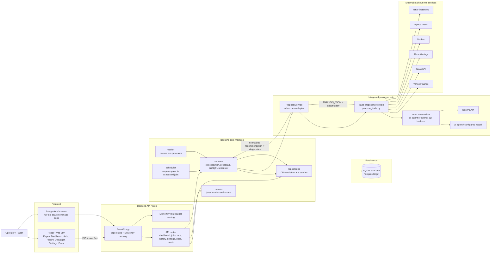

# Architecture

## Architecture choice

Use a modular monolith first, with explicit module boundaries and a later path to worker-based execution and selective service extraction.

This remains the right choice because it provides:
- low operational complexity
- clear code ownership boundaries
- easy local startup
- a future path to microservices without forcing them too early

## Current runtime reality

### Implemented now
- one FastAPI backend process serving the product API
- one React/Vite frontend for operator workflows
- SQLite as the default local persistence engine
- worker and scheduler entrypoints
- repository-based persistence access

### Target deployment runtime
- API process
- worker process
- scheduler process
- frontend assets served by the API or reverse proxy
- Postgres
- Redis

## System diagram

## Diagram notes

How to read the diagram:
- the operator interacts only with the React frontend
- the frontend talks to the FastAPI backend over `/api`
- the backend owns domain logic, persistence, orchestration, and health/preflight behavior
- recommendation generation is delegated to the integrated prototype through `ProposalService`
- the prototype pulls from external news/market services and optional LLM summarization backends
- the app stores both normalized recommendation data and richer raw diagnostics for debugger/history use

Most important runtime flow today:
1. user creates or executes a job from the frontend
2. backend enqueues a run in the database
3. worker claims the queued run
4. `JobExecutionService` resolves tickers and calls `ProposalService`
5. `ProposalService` shells out to the prototype script
6. prototype fetches external data, runs analysis, and emits structured `ANALYSIS_JSON`
7. backend normalizes and persists the recommendation, diagnostics, and run timing
8. frontend reads the resulting run/recommendation state back via `/api`

## Runtime components

### 1. API process
Responsibilities:
- expose JSON endpoints for dashboard, runs, jobs, watchlists, history, settings, docs, and health
- validate user input
- create jobs and runs
- read and write database state
- optionally serve built frontend assets from `frontend/dist`

### 2. Frontend
Responsibilities:
- present operator workflows for setup, monitoring, debugging, history review, and docs browsing
- consume the API using typed fetch helpers
- keep UI logic client-side while leaving domain logic on the backend

Implementation constraints:
- React + TypeScript + Vite only
- no global state library
- no UI framework dependency
- one shared stylesheet and small reusable component layer

### 3. Worker process
Responsibilities:
- execute recommendation pipelines asynchronously
- call the prototype-backed proposal service
- persist run results
- mark warnings and failures

### 4. Scheduler process
Responsibilities:
- read active job schedules
- enqueue due runs
- avoid duplicate scheduling

Current state:
- now persists a `scheduled_for` slot identity on scheduled runs
- prevents duplicate enqueues for the same job and schedule slot
- currently uses a UTC-normalized 5-field cron subset with support for `*`, `*/n`, exact values, and comma-separated exact values
- does not yet support the full cron feature surface, such as ranges
- still needs more hardening around broader concurrency and production-grade schedule semantics

### 5. Persistence
Current default:
- SQLite for lightweight startup and fast local validation

Target:
- Postgres as durable system of record

Stored entities today:
- watchlists
- jobs
- runs
- recommendations
- app settings
- provider credentials

## Internal module boundaries

### `domain`
Owns core models and typed contracts.

### `repositories`
Owns persistence translation between SQLAlchemy records and domain models.

### `services`
Owns proposal generation, job execution, scheduling, and preflight logic.

### `api`
Owns machine-facing routes.
The React frontend should use these routes instead of duplicating backend logic.

### `web`
Owns SPA entry serving for browser routes.
This layer is now intentionally thin.

### `frontend`
Owns the React/Vite application.
Suggested internal boundaries:
- pages
- shared components
- typed API helpers
- minimal formatting utilities

## Why this split stays minimal

Because the added frontend complexity is constrained by:
- keeping business logic on the backend
- keeping client state shallow and page-local
- using fetch directly instead of adding a data library
- avoiding a separate frontend package workspace
- serving built assets from the existing backend when needed

## Immediate next architectural moves

1. extend preflight to validate summary-backend-specific requirements
2. continue hardening scheduler behavior
3. support credential rotation
4. keep frontend and API contracts documented and intentionally small
