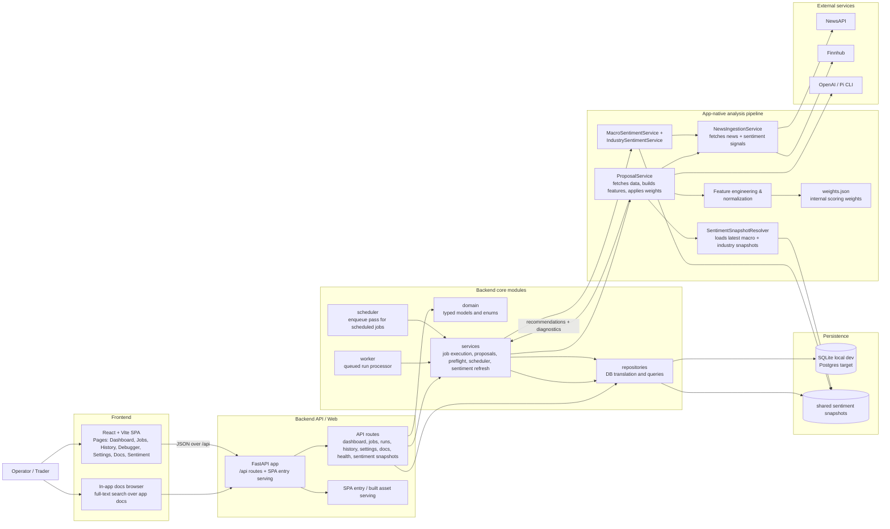

# Architecture

## Architecture choice

Trade Proposer App uses a modular monolith with explicit internal boundaries. That remains the right choice because the product still benefits more from local simplicity and shared schemas than from early service extraction.

This choice is effective when it preserves three principles:
- keep business logic on the backend
- keep runtime topology easy to start and debug locally
- make future extraction possible without designing for it prematurely

## Current runtime reality

### Implemented now
- one FastAPI backend process serving the product API
- one React/Vite frontend for operator workflows
- SQLite as the default local persistence engine
- worker and scheduler entrypoints
- repository-based persistence access
- app-native proposal, evaluation, optimization, and sentiment-refresh workflows
- shared sentiment snapshot storage and snapshot-aware health/preflight reporting

### Target deployment runtime
- API process
- worker process
- scheduler process
- frontend assets served by the API or reverse proxy
- Postgres
- Redis or another queue/coordination layer if concurrency pressure justifies it

## System diagram

## Most important runtime flow today

### Proposal generation
1. user creates or executes a proposal job from the frontend
2. backend enqueues a run in the database
3. worker claims the queued run atomically
4. `JobExecutionService` calls `ProposalService`
5. `ProposalService` fetches price history, computes technical features, loads the latest valid macro and industry snapshots, and computes live ticker sentiment
6. the pipeline emits direction, confidence, entry/stop/take-profit, and diagnostic payloads
7. backend persists the recommendation, diagnostics, run summary, and timing data
8. frontend reads run and recommendation state back via `/api`

### Shared sentiment refresh
1. scheduler or operator triggers macro/industry refresh
2. backend enqueues a refresh run
3. worker claims the run, or the operator uses the `run-now` endpoint for immediate execution
4. refresh services compute shared sentiment and persist `SentimentSnapshot` records
5. health/preflight reports whether those snapshots are fresh enough for proposal generation

## Runtime components

### 1. API process
Responsibilities:
- expose JSON endpoints for dashboard, runs, jobs, watchlists, history, settings, docs, health, and sentiment snapshots
- validate user input
- create jobs and runs
- read and write database state
- optionally serve built frontend assets from `frontend/dist`

### 2. Frontend
Responsibilities:
- present operator workflows for setup, monitoring, debugging, history review, docs browsing, and sentiment inspection
- consume the API using typed fetch helpers
- keep UI logic client-side while leaving domain logic on the backend

Implementation constraints:
- React + TypeScript + Vite only
- no global state library
- no UI framework dependency
- one shared stylesheet and small reusable component layer

### 3. Worker process
Responsibilities:
- execute recommendation, evaluation, optimization, and sentiment-refresh workflows asynchronously
- persist run results
- mark warnings and failures explicitly

### 4. Scheduler process
Responsibilities:
- read active job schedules
- enqueue due runs
- avoid duplicate scheduling

Current state:
- persists a `scheduled_for` slot identity on scheduled runs
- prevents duplicate enqueues for the same job and schedule slot
- supports a constrained cron surface suitable for the product's built-in scheduling needs
- still needs more hardening around overlapping jobs, crash recovery, and production-grade coordination

### 5. Persistence
Current default:
- SQLite for lightweight startup and fast local validation

Target:
- Postgres as durable system of record

Stored entities today:
- watchlists
- jobs
- runs
- recommendations
- sentiment snapshots
- app settings
- provider credentials

## Internal module boundaries

### `domain`
Owns core models and typed contracts.

### `repositories`
Owns persistence translation between SQLAlchemy records and domain models.

### `services`
Owns proposal generation, sentiment refresh, job execution, scheduling, and preflight logic.

### `api`
Owns machine-facing routes. The React frontend should use these routes instead of duplicating backend logic.

### `web`
Owns SPA entry serving. This layer is intentionally thin.

### `frontend`
Owns the React/Vite application.

## Architectural assessment

The architecture is internally consistent in one important way: execution, diagnostics, persistence, and the UI all now share the same backend-owned contract. That reduces drift.

Its weakest point is not the module split; it is the growing amount of operational behavior carried by one process family without yet having production-grade coordination. The codebase is still coherent, but scheduler reliability, auth/credential lifecycle, and observability are now more urgent than additional feature breadth.

## Immediate next architectural moves

1. harden scheduler and worker coordination for overlapping and recovering workloads
2. improve production observability (structured logs, run correlation, health signals)
3. complete credential lifecycle work instead of adding more provider surface area
4. keep API payloads and diagnostic schemas small, explicit, and versioned when they change materially
