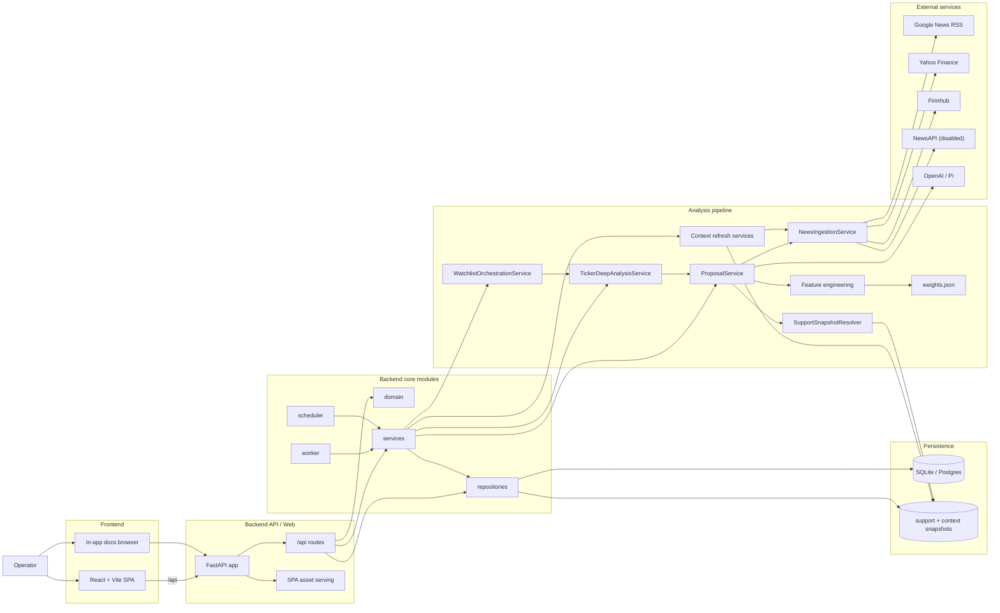

# Architecture

**Status:** canonical current architecture

## Architecture choice

Trade Proposer App is a modular monolith.

That remains the right fit because the product benefits more from:
- simple local startup
- one shared schema
- backend-owned business logic

than from early service extraction.

## Runtime shape

Implemented now:
- FastAPI backend
- React/Vite frontend
- worker process
- scheduler process
- SQLite by default for local development
- Postgres support for production-like local runs and deployment
- repository-based persistence access
- app-native proposal, evaluation, optimization, and context-refresh workflows

Target deployment shape:
- API
- worker
- scheduler
- frontend assets served by the API or a reverse proxy
- Postgres
- optional stronger queue/coordination infrastructure if concurrency pressure increases

## System diagram

## Most important runtime flows

### Proposal generation
1. the operator creates or runs a proposal job
2. the backend enqueues a run in the database
3. the worker claims the queued run
4. `JobExecutionService` executes the orchestration path
5. the pipeline fetches price history, computes features, loads shared macro and industry artifacts, and performs ticker analysis
6. the system emits ticker signals, recommendation plans, and diagnostics
7. the backend persists run state, redesign-native objects, and artifacts
8. the frontend reads them back through `/api`

If execution fails, run timing, status, and failure metadata are still persisted. Full cross-workflow rollback is still limited.

### Context refresh
1. the scheduler or operator triggers a macro or industry refresh
2. the backend enqueues a refresh run
3. the worker executes it asynchronously
4. industry refresh scope is seeded from the taxonomy layer
5. refresh services persist transitional support snapshots and redesign-native context snapshots
6. downstream review pages surface the resulting context and diagnostics

## Runtime components

### API process
Responsibilities:
- expose JSON endpoints for runs, jobs, watchlists, recommendations, settings, docs, health, and context
- validate input
- create jobs and runs
- read and write database state
- optionally serve built frontend assets

### Frontend
Responsibilities:
- present operator workflows for setup, monitoring, debugging, recommendation review, context review, settings, and docs
- consume backend APIs
- keep domain logic on the backend

### Worker process
Responsibilities:
- execute recommendation, evaluation, optimization, and refresh workflows asynchronously
- persist results
- mark warnings and failures explicitly

Current state:
- queued runs are claimed with guarded updates to reduce duplicate execution
- worker heartbeats and run leases are implemented
- stale active runs can be recovered when a worker lease expires, with older timeout-based fallback behavior still present in some paths

### Scheduler process
Responsibilities:
- read active job schedules
- enqueue due runs
- avoid duplicate scheduling

Current state:
- scheduled runs persist a `scheduled_for` slot
- duplicate enqueues for the same job/slot are prevented
- coordination is good enough for the current model, but still needs more hardening as concurrency grows

### Persistence
Current default:
- SQLite for easy local startup

Production-like option:
- Postgres

Stored entities include:
- watchlists
- jobs
- runs
- support snapshots
- macro, industry, and ticker context/signal objects
- recommendation plans and outcomes
- settings
- provider credentials

See `er-model.md` for the schema overview.

## Internal module boundaries

### `domain`
Core models and typed contracts.

### `repositories`
Persistence translation and queries.

### `services`
Proposal generation, refresh, job execution, scheduling, and preflight logic.

### `api`
Machine-facing routes used by the frontend.

### `web`
Thin SPA entry and asset-serving layer.

### `frontend`
The React/Vite application.

## Architectural assessment

The main strength is shared ownership of execution, diagnostics, persistence, and API contracts inside one backend. That reduces drift.

The main weakness is operational maturity, not the module split. Reliability, observability, and credential lifecycle matter more right now than additional architectural complexity.

A second transitional issue remains: context snapshots are the main review surface, but legacy support snapshots still remain in some refresh, resolver, and health paths.

## Immediate next moves

1. keep hardening scheduler and worker coordination
2. improve production observability with better logs, correlation, and health signals
3. improve credential lifecycle and production auth hygiene
4. keep API payloads and diagnostics explicit and stable
5. finish converging legacy support-snapshot paths onto context-native reads
