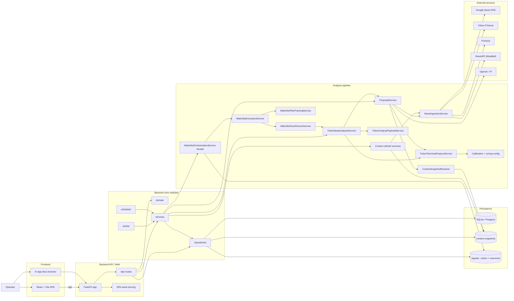

# Architecture

**Status:** current behavior

## Architecture choice

Trade Proposer App is a modular monolith.

That remains the right fit because the product benefits more from:
- simple local startup
- one shared schema
- backend-owned business logic

than from early service extraction.

## Runtime shape

Implemented now:
- FastAPI backend
- React/Vite frontend
- worker process
- scheduler process
- SQLite by default for local development
- Postgres support for production-like local runs and deployment
- repository-based persistence access
- app-native proposal, evaluation, optimization, and context-refresh workflows

Target deployment shape:
- API
- worker
- scheduler
- frontend assets served by the API or a reverse proxy
- Postgres
- optional stronger queue/coordination infrastructure if concurrency pressure increases

## System diagram

```mermaid
flowchart LR
    User["Operator"]

    subgraph Frontend["Frontend"]
        SPA["React + Vite SPA"]
        DocsUI["In-app docs browser"]
    end

    subgraph Backend["Backend API / Web"]
        FastAPI["FastAPI app"]
        APIRoutes["/api routes"]
        WebEntry["SPA asset serving"]
    end

    subgraph Core["Backend core modules"]
        Domain["domain"]
        Repositories["repositories"]
        Services["services"]
        Workers["worker"]
        Scheduler["scheduler"]
    end

    subgraph Storage["Persistence"]
        DB[("SQLite / Postgres")]
        ContextSnapshots[("context snapshots")]
        AnalysisRecords[("signals + plans + outcomes")]
    end

    subgraph Pipeline["Analysis pipeline"]
        Orchestration["WatchlistOrchestrationService facade"]
        WatchlistExecution["WatchlistExecutionService"]
        WatchlistScan["WatchlistScanRunnerService"]
        WatchlistPlanFraming["WatchlistPlanFramingService"]
        DeepAnalysis["TickerDeepAnalysisService"]
        ProposalService["ProposalService"]
        SnapshotResolver["ContextSnapshotResolver"]
        NewsIngestionService["NewsIngestionService"]
        FeatureService["TickerTechnicalFeatureService"]
        PayloadService["TickerAnalysisPayloadService"]
        Calibration["Calibration + tuning config"]
        RefreshServices["Context refresh services"]
    end

    subgraph External["External services"]
        GoogleNews["Google News RSS"]
        YahooFinance["Yahoo Finance"]
        Finnhub["Finnhub"]
        NewsAPI["NewsAPI (disabled)"]
        OptionalLLM["OpenAI / Pi"]
    end

    User --> SPA
    User --> DocsUI
    SPA -->|/api| FastAPI
    DocsUI --> FastAPI
    FastAPI --> APIRoutes
    FastAPI --> WebEntry

    APIRoutes --> Domain
    APIRoutes --> Repositories
    APIRoutes --> Services
    Workers --> Services
    Scheduler --> Services
    Services --> Repositories
    Repositories --> DB
    Repositories --> ContextSnapshots
    Repositories --> AnalysisRecords

    Services --> Orchestration
    Services --> DeepAnalysis
    Services --> ProposalService
    Services --> RefreshServices
    Orchestration --> WatchlistExecution
    WatchlistExecution --> WatchlistScan
    WatchlistExecution --> WatchlistPlanFraming
    WatchlistScan --> DeepAnalysis
    DeepAnalysis --> ProposalService
    DeepAnalysis --> FeatureService
    DeepAnalysis --> PayloadService
    ProposalService --> SnapshotResolver
    ProposalService --> FeatureService
    ProposalService --> NewsIngestionService
    FeatureService --> Calibration
    RefreshServices --> NewsIngestionService
    RefreshServices --> ContextSnapshots
    SnapshotResolver --> ContextSnapshots
    Orchestration --> AnalysisRecords

    NewsIngestionService --> GoogleNews
    NewsIngestionService --> YahooFinance
    NewsIngestionService --> Finnhub
    NewsIngestionService --> NewsAPI
    ProposalService --> OptionalLLM
```

## Analysis architecture

The recommendation pipeline is organized around four conceptual layers:

1. **Context** — identify what matters now through macro and industry context snapshots.
2. **Exposure** — map active context into industry and ticker impact through explicit transmission channels.
3. **Ticker setup** — decide whether a ticker has a realistic short-horizon swing setup using catalysts, sentiment, technical structure, liquidity, and context alignment.
4. **Trade plan** — convert a valid setup into entry, stop, target, horizon, confidence, risks, and an actionable or non-actionable state.

This is an architecture for shortlist, setup evaluation, and trade framing. It is not proof of predictive skill by itself.

The active watchlist implementation is split by behavior: `WatchlistExecutionService` coordinates a full run, `ShortlistSelectionService` selects candidates, `WatchlistScanRunnerService` normalizes cheap-scan/deep-analysis execution failures, `WatchlistSignalBuilder` builds signal snapshots, `WatchlistPlanFramingService` builds plans, and focused services build narrative, calibration, transmission, and decision-sample payloads. `WatchlistOrchestrationService` remains the compatibility facade that wires those slices together.

The active persistence truth for this workflow is:
- `TickerSignalSnapshot`
- `RecommendationPlan`
- `RecommendationPlanOutcome`
- broker order/position lifecycle records when a plan is submitted to Alpaca paper

Older compatibility objects may still exist in domain code or tests, but they should not become the main operator truth again.

## Most important runtime flows

### Proposal generation
1. the operator creates or runs a proposal job
2. the backend enqueues a run in the database
3. the worker claims the queued run
4. `JobExecutionService` calls the watchlist orchestration facade, which delegates run coordination to `WatchlistExecutionService`
5. the pipeline fetches price history, uses `TickerTechnicalFeatureService` for technical/context feature construction, uses `TickerAnalysisPayloadService` for persisted analysis payloads/diagnostics, loads shared macro and industry artifacts, and performs ticker analysis
6. shared context refreshes classify active events into persisted fields such as persistence state, state transition, catalyst type, market interpretation, and trigger actor metadata
7. the system emits ticker signals, recommendation plans, and diagnostics
8. the backend persists run state, redesign-native objects, and artifacts
9. the frontend reads them back through `/api`

If execution fails, run timing, status, and failure metadata are still persisted. Full cross-workflow rollback is still limited.

### Partial-persistence semantics

Current behavior intentionally preserves already-written audit artifacts instead of rolling back an entire run after a late failure.

Validity rules:
- `Run.status = completed` means run artifacts, signals, plans, and decision samples from that run are valid for normal operator review and downstream evaluation.
- `Run.status = completed_with_warnings` means persisted artifacts are valid, but degraded-input and warning payloads must be reviewed before using the run for promotion decisions.
- `Run.status = failed` means the run-level workflow failed; any signals, plans, or decision samples already written remain audit evidence, but they must not be used for automatic tuning promotion or autonomy expansion unless the downstream service explicitly marks them replay-safe and complete.
- Broker order and broker position lifecycle rows remain canonical audit records even when their originating run later fails.
- Calibration, reliability, and tuning services should prefer broker/effective outcome completeness over run success alone, and must not silently treat partial failed-run artifacts as promotion-quality evidence.

This preserves forensic visibility while preventing partial failed runs from overstating evidence quality.

### Context refresh
1. the scheduler or operator triggers a macro or industry refresh
2. the backend enqueues a refresh run
3. the worker executes it asynchronously
4. industry refresh scope is seeded from the taxonomy layer
5. industry refresh queries can be expanded from ontology definitions such as themes, event vocabulary, risk flags, sector, and company names
6. refresh services persist redesign-native context snapshots directly
7. downstream review pages surface the resulting context, event fields, actor/source metadata, and diagnostics

## Runtime components

### API process
Responsibilities:
- expose JSON endpoints for runs, jobs, watchlists, recommendations, settings, docs, health, and context
- validate input
- create jobs and runs
- read and write database state
- optionally serve built frontend assets

### Frontend
Responsibilities:
- present operator workflows for setup, monitoring, debugging, recommendation review, context review, settings, and docs
- consume backend APIs
- keep domain logic on the backend

### Worker process
Responsibilities:
- execute recommendation, evaluation, optimization, and refresh workflows asynchronously
- persist results
- mark warnings and failures explicitly

Current state:
- queued runs are claimed with guarded updates to reduce duplicate execution
- worker heartbeats and run leases are implemented
- stale active runs can be recovered when a worker lease expires, with older timeout-based fallback behavior still present in some paths

### Scheduler process
Responsibilities:
- read active job schedules
- enqueue due runs
- avoid duplicate scheduling

Current state:
- scheduled runs persist a `scheduled_for` slot
- duplicate enqueues for the same job/slot are prevented
- coordination is good enough for the current model, but still needs more hardening as concurrency grows

### Persistence
Current default:
- SQLite for easy local startup

Production-like option:
- Postgres

Stored entities include:
- watchlists
- jobs
- runs
- macro, industry, and ticker context/signal objects
- recommendation plans and outcomes
- settings
- provider credentials

See `er-model.md` for the schema overview.

## Internal module boundaries

### `domain`
Core models and typed contracts.

### `repositories`
Persistence translation and queries.

### `services`
Proposal generation, refresh, job execution, scheduling, and preflight logic.

### `api`
Machine-facing routes used by the frontend.

### `web`
Thin SPA entry and asset-serving layer.

### `frontend`
The React/Vite application.

## Architectural assessment

The main strength is shared ownership of execution, diagnostics, persistence, and API contracts inside one backend. That reduces drift.

The main weakness is operational maturity, not the module split. Reliability, observability, and credential lifecycle matter more right now than additional architectural complexity.

Context snapshots are now the only active review and refresh persistence layer.

## Immediate next moves

1. keep hardening scheduler and worker coordination
2. improve production observability with better logs, correlation, and health signals
3. improve credential lifecycle and production auth hygiene
4. keep API payloads and diagnostics explicit and stable
