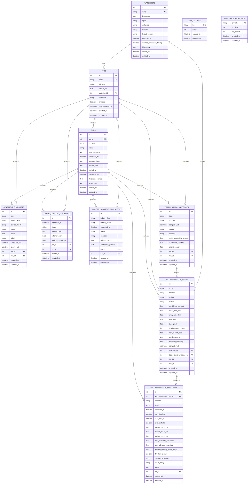

# ER Model

**Status:** current database entity-relationship reference

This document describes the current database shape reflected by the live SQLAlchemy persistence models in `src/trade_proposer_app/persistence/models.py`.

Notes:
- this is a practical ER view of the current app schema, not an aspirational redesign-only schema
- the legacy `recommendations` table was removed in migration `0015_drop_legacy_recommendations_table.py`
- several tables store structured payloads in `*_json` text columns, so not every business concept is normalized into its own table
- some foreign keys exist without explicit ORM back-populated relationship fields, but they are still part of the relational model

## Mermaid ER diagram

This diagram intentionally uses plain Mermaid ER syntax with unquoted entity identifiers so it stays compatible with the in-app renderer.

## Relationship summary

Core execution chain:
- `watchlists -> jobs -> runs`
- `runs` act as the execution record for scheduled or manual work

Context and signal outputs:
- `sentiment_snapshots` attach to a `job` and/or `run`
- `macro_context_snapshots` attach to a `job` and/or `run`
- `industry_context_snapshots` attach to a `job` and/or `run`
- `ticker_signal_snapshots` attach to a `job` and/or `run`

Trade-planning outputs:
- `recommendation_plans` can attach to:
  - a `watchlist`
  - a `ticker_signal_snapshot`
  - a `job`
  - a `run`
- `recommendation_outcomes` attach to exactly one `recommendation_plan`
- `recommendation_outcomes` may also attach to the `run` that performed evaluation

Standalone tables:
- `app_settings`
- `provider_credentials`

## Source of truth

If this diagram drifts from the implementation, treat these as the authoritative sources in order:
1. `src/trade_proposer_app/persistence/models.py`
2. `alembic/versions/`
3. this document
