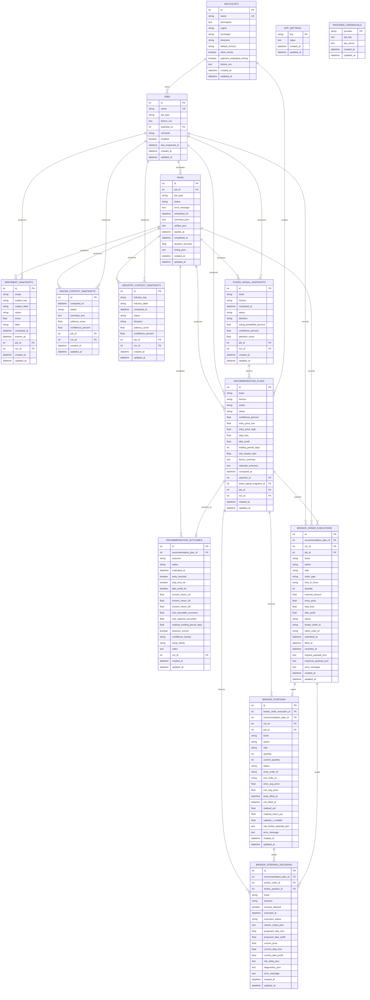

# ER Model

**Status:** reference

This document describes the current database shape reflected by the live SQLAlchemy persistence models in `src/trade_proposer_app/persistence/models.py`.

Notes:
- this is a practical ER view of the current app schema, not an aspirational redesign-only schema
- Postgres is the target production datastore; SQLite remains the default local startup datastore
- the legacy `recommendations` table was removed in migration `0015_drop_legacy_recommendations_table.py`
- several tables store structured payloads in `*_json` text columns, so not every business concept is normalized into its own table
- diagnostics are first-class persisted data, not log-only data: warnings, missing inputs, provider failures, confidence caps, suppression reasons, evidence counts, and source breakdowns should remain queryable or embedded in durable payloads
- some foreign keys exist without explicit ORM back-populated relationship fields, but they are still part of the relational model

## Mermaid ER diagram

This diagram intentionally uses plain Mermaid ER syntax with unquoted entity identifiers so it stays compatible with the in-app renderer.

```mermaid
erDiagram
    WATCHLISTS {
        int id PK
        string name UK
        text description
        string region
        string exchange
        string timezone
        string default_horizon
        boolean allow_shorts
        boolean optimize_evaluation_timing
        text tickers_csv
        datetime created_at
        datetime updated_at
    }

    JOBS {
        int id PK
        string name UK
        string job_type
        text tickers_csv
        int watchlist_id FK
        string schedule
        boolean enabled
        datetime last_enqueued_at
        datetime created_at
        datetime updated_at
    }

    RUNS {
        int id PK
        int job_id FK
        string job_type
        string status
        text error_message
        datetime scheduled_for
        text summary_json
        text artifact_json
        datetime started_at
        datetime completed_at
        float duration_seconds
        text timing_json
        datetime created_at
        datetime updated_at
    }

    APP_SETTINGS {
        string key PK
        text value
        datetime created_at
        datetime updated_at
    }

    PROVIDER_CREDENTIALS {
        string provider PK
        text api_key
        text api_secret
        datetime created_at
        datetime updated_at
    }

    SENTIMENT_SNAPSHOTS {
        int id PK
        string scope
        string subject_key
        string subject_label
        string status
        float score
        string label
        datetime computed_at
        datetime expires_at
        int job_id FK
        int run_id FK
        datetime created_at
        datetime updated_at
    }

    MACRO_CONTEXT_SNAPSHOTS {
        int id PK
        datetime computed_at
        string status
        text summary_text
        float saliency_score
        float confidence_percent
        int job_id FK
        int run_id FK
        datetime created_at
        datetime updated_at
    }

    INDUSTRY_CONTEXT_SNAPSHOTS {
        int id PK
        string industry_key
        string industry_label
        datetime computed_at
        string status
        string direction
        float saliency_score
        float confidence_percent
        int job_id FK
        int run_id FK
        datetime created_at
        datetime updated_at
    }

    TICKER_SIGNAL_SNAPSHOTS {
        int id PK
        string ticker
        string horizon
        datetime computed_at
        string status
        string direction
        float swing_probability_percent
        float confidence_percent
        float attention_score
        int job_id FK
        int run_id FK
        datetime created_at
        datetime updated_at
    }

    RECOMMENDATION_PLANS {
        int id PK
        string ticker
        string horizon
        string action
        string status
        float confidence_percent
        float entry_price_low
        float entry_price_high
        float stop_loss
        float take_profit
        int holding_period_days
        float risk_reward_ratio
        text thesis_summary
        text rationale_summary
        datetime computed_at
        int watchlist_id FK
        int ticker_signal_snapshot_id FK
        int job_id FK
        int run_id FK
        datetime created_at
        datetime updated_at
    }

    RECOMMENDATION_OUTCOMES {
        int id PK
        int recommendation_plan_id FK
        string outcome
        string status
        datetime evaluated_at
        boolean entry_touched
        boolean stop_loss_hit
        boolean take_profit_hit
        float horizon_return_1d
        float horizon_return_3d
        float horizon_return_5d
        float max_favorable_excursion
        float max_adverse_excursion
        float realized_holding_period_days
        boolean direction_correct
        string confidence_bucket
        string setup_family
        text notes
        int run_id FK
        datetime created_at
        datetime updated_at
    }

    BROKER_ORDER_EXECUTIONS {
        int id PK
        int recommendation_plan_id FK
        int run_id FK
        int job_id FK
        string ticker
        string action
        string side
        string order_type
        string time_in_force
        int quantity
        float notional_amount
        float entry_price
        float stop_loss
        float take_profit
        string status
        string broker_order_id
        string client_order_id
        datetime submitted_at
        datetime filled_at
        datetime canceled_at
        text request_payload_json
        text response_payload_json
        text error_message
        datetime created_at
        datetime updated_at
    }

    BROKER_POSITIONS {
        int id PK
        int broker_order_execution_id FK
        int recommendation_plan_id FK
        int run_id FK
        int job_id FK
        string ticker
        string action
        string side
        int quantity
        int current_quantity
        string status
        string entry_order_id
        string exit_order_id
        float entry_avg_price
        float exit_avg_price
        datetime entry_filled_at
        datetime exit_filled_at
        float realized_pnl
        float realized_return_pct
        float realized_r_multiple
        text raw_broker_payload_json
        text error_message
        datetime created_at
        datetime updated_at
    }

    BROKER_STEERING_DECISIONS {
        int id PK
        int recommendation_plan_id FK
        int broker_order_id FK
        int broker_position_id FK
        string ticker
        string decision
        boolean execute_allowed
        datetime executed_at
        string execution_status
        text reason_codes_json
        float proposed_stop_loss
        float proposed_take_profit
        float current_price
        float current_stop_loss
        float current_take_profit
        text risk_delta_json
        text diagnostics_json
        text error_message
        datetime created_at
        datetime updated_at
    }

    WATCHLISTS ||--o{ JOBS : owns
    JOBS ||--o{ RUNS : schedules

    WATCHLISTS ||--o{ RECOMMENDATION_PLANS : scopes
    JOBS ||--o{ SENTIMENT_SNAPSHOTS : produces
    RUNS ||--o{ SENTIMENT_SNAPSHOTS : produces

    JOBS ||--o{ MACRO_CONTEXT_SNAPSHOTS : produces
    RUNS ||--o{ MACRO_CONTEXT_SNAPSHOTS : produces

    JOBS ||--o{ INDUSTRY_CONTEXT_SNAPSHOTS : produces
    RUNS ||--o{ INDUSTRY_CONTEXT_SNAPSHOTS : produces

    JOBS ||--o{ TICKER_SIGNAL_SNAPSHOTS : produces
    RUNS ||--o{ TICKER_SIGNAL_SNAPSHOTS : produces

    TICKER_SIGNAL_SNAPSHOTS ||--o{ RECOMMENDATION_PLANS : informs
    JOBS ||--o{ RECOMMENDATION_PLANS : produces
    RUNS ||--o{ RECOMMENDATION_PLANS : produces

    RECOMMENDATION_PLANS ||--o| RECOMMENDATION_OUTCOMES : resolves_to
    RUNS ||--o{ RECOMMENDATION_OUTCOMES : evaluates

    RECOMMENDATION_PLANS ||--o{ BROKER_ORDER_EXECUTIONS : submits
    RUNS ||--o{ BROKER_ORDER_EXECUTIONS : records
    JOBS ||--o{ BROKER_ORDER_EXECUTIONS : records
    BROKER_ORDER_EXECUTIONS ||--o| BROKER_POSITIONS : opens
    RECOMMENDATION_PLANS ||--o{ BROKER_POSITIONS : resolves
    BROKER_ORDER_EXECUTIONS ||--o{ BROKER_STEERING_DECISIONS : audits
    BROKER_POSITIONS ||--o{ BROKER_STEERING_DECISIONS : audits
    RECOMMENDATION_PLANS ||--o{ BROKER_STEERING_DECISIONS : informs
```

## Relationship summary

Core execution chain:
- `watchlists -> jobs -> runs`
- `runs` act as the execution record for scheduled or manual work

Context and signal outputs:
- `sentiment_snapshots` attach to a `job` and/or `run`
- `macro_context_snapshots` attach to a `job` and/or `run`
- `industry_context_snapshots` attach to a `job` and/or `run`
- `ticker_signal_snapshots` attach to a `job` and/or `run`

Trade-planning outputs:
- `recommendation_plans` can attach to:
  - a `watchlist`
  - a `ticker_signal_snapshot`
  - a `job`
  - a `run`
Outcome evaluation:
- `recommendation_outcomes` attach to exactly one `recommendation_plan`
- `recommendation_outcomes` may also attach to the `run` that performed evaluation
- the `outcome` field can be `win`, `loss`, `expired`, `no_action`, `watchlist`, `phantom_win`, `phantom_loss`, or `phantom_no_entry`
- phantom outcomes are produced when a `no_action` plan carried an `intended_action` and valid trade levels, allowing the evaluation engine to simulate the skipped trade against real market data

Broker execution and steering outputs:
- `broker_order_executions` attach to a `recommendation_plan`, `job`, and `run`
- `broker_positions` attach to the parent `broker_order_execution` and resolve back to a `recommendation_plan`
- `broker_steering_decisions` attach to the relevant `recommendation_plan` and, when present, the app-owned broker order/position ids used for the decision

Standalone tables:
- `app_settings`
- `provider_credentials`

## Source of truth

If this diagram drifts from the implementation, treat these as the authoritative sources in order:
1. `src/trade_proposer_app/persistence/models.py`
2. `alembic/versions/`
3. this document
